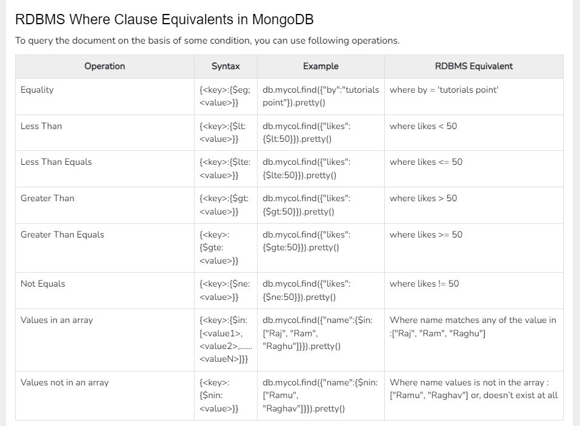

## MongoDB Questions

### References:

- https://www.tutorialspoint.com/mongodb/mongodb_advantages.htm
- https://www.humongous.io/app/playground/mongodb/new

***
### What are Data Model Design in mongodb ?

MongoDB provides two types of data models: — Embedded data model and Normalized data model.
    
#### Embedded Data Model:

In this model, you can have (embed) all the related data in a single document.
        
```json
{
    _id: ,
    Emp_ID: "10025AE336"
    Personal_details:{
        First_Name: "Radhika",
        Last_Name: "Sharma",
        Date_Of_Birth: "1995-09-26"
    },
    Contact: {
        e-mail: "radhika_sharma.123@gmail.com",
        phone: "9848022338"
    },
    Address: {
        city: "Hyderabad",
        Area: "Madapur",
        State: "Telangana"
    }
}
```

#### Normalized Data Model:

In this model, you can refer the sub documents in the original document, using references.
    
```json
// Employee
{
    _id: <ObjectId101>,
    Emp_ID: "10025AE336"
}
// Personal_details
{
    _id: <ObjectId102>,
    empDocID: " ObjectId101",
    First_Name: "Radhika",
    Last_Name: "Sharma",
    Date_Of_Birth: "1995-09-26"
}
// Contact
{
    _id: <ObjectId103>,
    empDocID: " ObjectId101",
    e-mail: "radhika_sharma.123@gmail.com",
    phone: "9848022338"
}
// Address
{
    _id: <ObjectId104>,
    empDocID: " ObjectId101",
    city: "Hyderabad",
    Area: "Madapur",
    State: "Telangana"
}
```

### Database commands ?

- MongoDB use DATABASE_NAME is used to create database. The command will create a new database if it doesn't exist, otherwise it will return the existing database.
    ```
    use DATABASE_NAME
    ```

- To check your currently selected database:
    ```
    db
    ```

- If you want to check your databases list:
    ```
    show dbs
    ```
    To display database, you need to insert at least one document into it otherwise it will not show on above command.

- MongoDB db.dropDatabase() command is used to drop a existing database.
    ```
    db.dropDatabase()
    ```
    This will delete the selected database. If you have not selected any database, then it will delete default 'test' database.

- Create Collection:
    ```
    db.createCollection(name, options)
    ```

    Example: 
    ```json
    db.createCollection("mycol", {
        capped : true,
        autoIndexID : true,
        size : 6142800,
        max : 10000
    })
    ```

- Drop collection from database:

    ```
    db.COLLECTION_NAME.drop()
    ```

- Check list of collections:
    ```
    show collections
    ```

- Insert Document:
    ```json
    db.COLLECTION_NAME.insert(document) // Flexible with one or more documents
    db.COLLECTION_NAME.insertOne(document) // Insert one document
    db.COLLECTION_NAME.insertMany(ARRAy_OF_DOCUMENTS) // Insert multiple document
    ```

    Example:
    ```json
    db.users.insert({
        _id : ObjectId("507f191e810c19729de860ea"),
        title: "MongoDB Overview",
        description: "MongoDB is no sql database",
        by: "tutorials point",
        url: "http://www.tutorialspoint.com",
        tags: ['mongodb', 'database', 'NoSQL'],
        likes: 100
    })
    ```

    If the collection doesn't exist in the database, then MongoDB will create this collection and then insert a document into it.
    You can also pass an array of documents into the insert() method

- Query Documents in collection:

    ```json
    db.COLLECTION_NAME.find() // Returns all the documents
    db.COLLECTION_NAME.findOne() // Returns only one document
    db.COLLECTION_NAME.find().pretty() // Give results in readable format
    ```
- RDBMS Where Clause Equivalents in MongoDB:

    

- AND in MongoDB:

    ```json
    // Format
    db.COLLECTION_NAME.find({
        $and: [ { <key1>:<value1> }, { <key2>:<value2> }, ... ] 
    })
    //Example
    db.mycol.find({
        $and:[{"by":"tutorials point"},{"title": "MongoDB Overview"}]
    })
    ```

- OR in MongoDB:
    
    ```json
    // Format
    db.COLLECTION_NAME.find({
        $or: [ { <key1>:<value1> }, { <key2>:<value2> }, ... ] 
    })
    //Example
    db.mycol.find({
        $or:[{"by":"tutorials point"},{"title": "MongoDB Overview"}]
    })
    ```

- Using AND and OR Together:

    ```json
    db.mycol.find({
        "likes": { $gt:10 },
        $or: [{"by": "tutorials point"},{"title": "MongoDB Overview"}]
    }).pretty()
    ```

- NOT in MongoDB:

    ```json
    db.COLLECTION_NAME.find({
        $not: [
            { "key1" : "value1" }, {"key2" :"value2" }
        ]
    })

    // Example
    db.empDetails.find({
        "Age": {
            $not: { $gt: "25" }
        }
    })
    ```