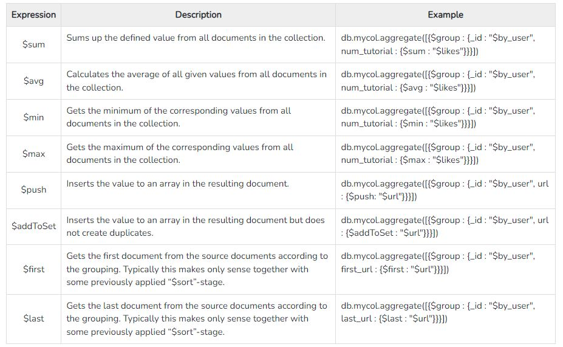

## MongoDB Questions

### References:

- https://www.tutorialspoint.com/mongodb/mongodb_advantages.htm
- https://www.humongous.io/app/playground/mongodb/new

***
### What are Data Model Design in mongodb ?

MongoDB provides two types of data models: — Embedded data model and Normalized data model.
    
#### Embedded Data Model:

In this model, you can have (embed) all the related data in a single document.
        
```json
{
    _id: ,
    Emp_ID: "10025AE336"
    Personal_details:{
        First_Name: "Radhika",
        Last_Name: "Sharma",
        Date_Of_Birth: "1995-09-26"
    },
    Contact: {
        e-mail: "radhika_sharma.123@gmail.com",
        phone: "9848022338"
    },
    Address: {
        city: "Hyderabad",
        Area: "Madapur",
        State: "Telangana"
    }
}
```

#### Normalized Data Model:

In this model, you can refer the sub documents in the original document, using references.
    
```json
// Employee
{
    _id: <ObjectId101>,
    Emp_ID: "10025AE336"
}
// Personal_details
{
    _id: <ObjectId102>,
    empDocID: " ObjectId101",
    First_Name: "Radhika",
    Last_Name: "Sharma",
    Date_Of_Birth: "1995-09-26"
}
// Contact
{
    _id: <ObjectId103>,
    empDocID: " ObjectId101",
    e-mail: "radhika_sharma.123@gmail.com",
    phone: "9848022338"
}
// Address
{
    _id: <ObjectId104>,
    empDocID: " ObjectId101",
    city: "Hyderabad",
    Area: "Madapur",
    State: "Telangana"
}
```

### Database commands ?

- MongoDB use DATABASE_NAME is used to create database. The command will create a new database if it doesn't exist, otherwise it will return the existing database.
    ```
    use DATABASE_NAME
    ```

- To check your currently selected database:
    ```
    db
    ```

- If you want to check your databases list:
    ```
    show dbs
    ```
    To display database, you need to insert at least one document into it otherwise it will not show on above command.

- MongoDB db.dropDatabase() command is used to drop a existing database.
    ```
    db.dropDatabase()
    ```
    This will delete the selected database. If you have not selected any database, then it will delete default 'test' database.

- Create Collection:
    ```
    db.createCollection(name, options)
    ```

    Example: 
    ```json
    db.createCollection("mycol", {
        capped : true,
        autoIndexID : true,
        size : 6142800,
        max : 10000
    })
    ```

- Drop collection from database:

    ```
    db.COLLECTION_NAME.drop()
    ```

- Check list of collections:
    ```
    show collections
    ```

- Insert Document:
    ```json
    db.COLLECTION_NAME.insert(document) // Flexible with one or more documents
    db.COLLECTION_NAME.insertOne(document) // Insert one document
    db.COLLECTION_NAME.insertMany(ARRAy_OF_DOCUMENTS) // Insert multiple document
    ```

    Example:
    ```json
    db.users.insert({
        _id : ObjectId("507f191e810c19729de860ea"),
        title: "MongoDB Overview",
        description: "MongoDB is no sql database",
        by: "tutorials point",
        url: "http://www.tutorialspoint.com",
        tags: ['mongodb', 'database', 'NoSQL'],
        likes: 100
    })
    ```

    If the collection doesn't exist in the database, then MongoDB will create this collection and then insert a document into it.
    You can also pass an array of documents into the insert() method

- Query Documents in collection:

    ```json
    db.COLLECTION_NAME.find() // Returns all the documents
    db.COLLECTION_NAME.findOne() // Returns only one document
    db.COLLECTION_NAME.find().pretty() // Give results in readable format
    ```
- RDBMS Where Clause Equivalents in MongoDB:

    

- AND in MongoDB:

    ```json
    // Format
    db.COLLECTION_NAME.find({
        $and: [ { <key1>:<value1> }, { <key2>:<value2> }, ... ] 
    })
    //Example
    db.mycol.find({
        $and:[{"by":"tutorials point"},{"title": "MongoDB Overview"}]
    })
    ```

- OR in MongoDB:
    
    ```json
    // Format
    db.COLLECTION_NAME.find({
        $or: [ { <key1>:<value1> }, { <key2>:<value2> }, ... ] 
    })
    //Example
    db.mycol.find({
        $or:[{"by":"tutorials point"},{"title": "MongoDB Overview"}]
    })
    ```

- Using AND and OR Together:

    ```json
    db.mycol.find({
        "likes": { $gt:10 },
        $or: [{"by": "tutorials point"},{"title": "MongoDB Overview"}]
    }).pretty()
    ```

- NOT in MongoDB:

    ```json
    db.COLLECTION_NAME.find({
        $not: [
            { "key1" : "value1" }, {"key2" :"value2" }
        ]
    })

    // Example
    db.empDetails.find({
        "Age": {
            $not: { $gt: "25" }
        }
    })
    ```

- MongoDB Update() Method:\
    MongoDB's update() and save() methods are used to update document into a collection. The update() method updates the values in the existing document while the save() method replaces the existing document with the document passed in save() method.

    ```json
    // Format
    db.COLLECTION_NAME.update( SELECTION_CRITERIA, UPDATED_DATA )
    // Example
    db.mycol.update(
        { "title":"MongoDB Overview" },
        { $set: { "title": "New MongoDB Tutorial", "name": "new_name" },
        { multi: true}
    })

    // Save
    db.COLLECTION_NAME.save({ _id:ObjectId() , NEW_DATA })
    // FindOneAndUpdate
    db.COLLECTION_NAME.findOneAndUpdate( SELECTIOIN_CRITERIA, UPDATED_DATA )
    // UpdateOne
    db.COLLECTION_NAME.updateOne( SELECTIOIN_CRITERIA, UPDATED_DATA)
    // UpdateMany
    db.COLLECTION_NAME.update( SELECTIOIN_CRITERIA, UPDATED_DATA)
    ```

    By default, MongoDB will update only a single document. To update multiple documents, you need to set a parameter 'multi' to true.

- Delete document in MongoDB:

    ```json
    // Deletion Criteria (Optional)
    // JustOne Flag (Optional) - if set to true or 1, then remove only one document. default value is not one
    db.COLLECTION_NAME.remove( DELETION_CRITTERIA, JUST_ONE_FLAG)
    
    // Example
    db.mycol.remove({"title":"MongoDB Overview"})
    ```

- Projection in MongoDB:\
    In MongoDB, projection means selecting only the necessary data rather than selecting whole of the data of a document. If a document has 5 fields and you need to show only 3, then select only 3 fields from them.

    ```json
    // 1 is used to show the field while 0 is used to hide the fields.
    db.mycol.find(
        {}, 
        {"title":1, _id:0}
    )
    ```

- Limiting & Skipping Records:\
    To limit the records in MongoDB, you need to use limit() method. The method accepts one number type argument, which is the number of documents that you want to be displayed.

    Apart from limit() method, there is one more method skip() which also accepts number type argument and is used to skip the number of documents.

    ```json
    // Limiting format
    db.COLLECTION_NAME.find().limit(NUMBER)
    // Example
    db.mycol.find(
        {},
        {"title":1,_id:0}
    ).limit(2)

    // Skipping format
    db.COLLECTION_NAME.find().limit(NUMBER).skip(NUMBER)
    
    // Following example will display only the second document.
    db.mycol.find(
        {},
        {"title":1,_id:0}
    ).limit(1).skip(1)
    ```

- Sorting Records in MongoDB:\
    To sort documents in MongoDB, you need to use sort() method. The method accepts a document containing a list of fields along with their sorting order. To specify sorting order 1 and -1 are used. 1 is used for ascending order while -1 is used for descending order.

    ```json
    db.COLLECTION_NAME.find().sort({ KEY:1, KEY2: 1})
    
    // You can use the following syntax to sort documents in MongoDB by multiple fields.
    // This particular code sorts the documents in the collection called myCollection first by field1 ascending and then by field2 descending.
    db.myCollection.find().sort( { "field1": 1, "field2": -1 } )
    ```

- Indexing in mongoDB:\
    Indexes are special data structures, that store a small portion of the data set in an easy-to-traverse form. The index stores the value of a specific field or set of fields, ordered by the value of the field as specified in the index.

    ```json
    // Format
    db.COLLECTION_NAME.createIndex({KEY:1})
    // Example 1
    db.mycol.createIndex({"title":1})

    // We can pass multiple fields, to create index on multiple fields.
    db.mycol.createIndex(
        {"title": 1,"description": -1}, 
        { "name": "index_1" }
    )
    
    // Deleting an index
    db.COLLECTION_NAME.dropIndex({KEY:1})
    dropIndex("name_of_the_index")

    // Fetch all indexes
    db.COLLECTION_NAME.getIndexes()
    ```

- Aggregation in MongoDB:\
    Aggregations operations process data records and return computed results. Aggregation operations group values from multiple documents together, and can perform a variety of operations on the grouped data to return a single result. In SQL count(*) and with group by is an equivalent of MongoDB aggregation.

    Example document:
    ```json
    {
        _id: ObjectId(7df78ad8902e)
        title: 'Neo4j Overview', 
        description: 'Neo4j is no sql database',
        by_user: 'Neo4j',
        url: 'http://www.neo4j.com',
        tags: ['neo4j', 'database', 'NoSQL'],
        likes: 750
    }
    ```

    ```json
    // Format
    db.COLLECTION_NAME.aggregate(AGGREGATE_OPERATION)
    // Example (  display a list stating how many tutorials are written by each user in above collection )
    db.mycol.aggregate([
        { $group : { _id : "$by_user", num_tutorial : { $sum : 1 } } }
    ])
    ```

    

